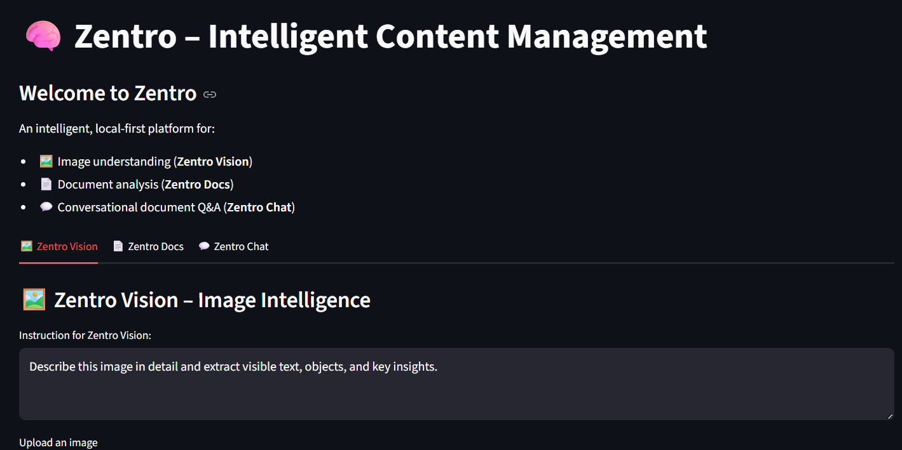
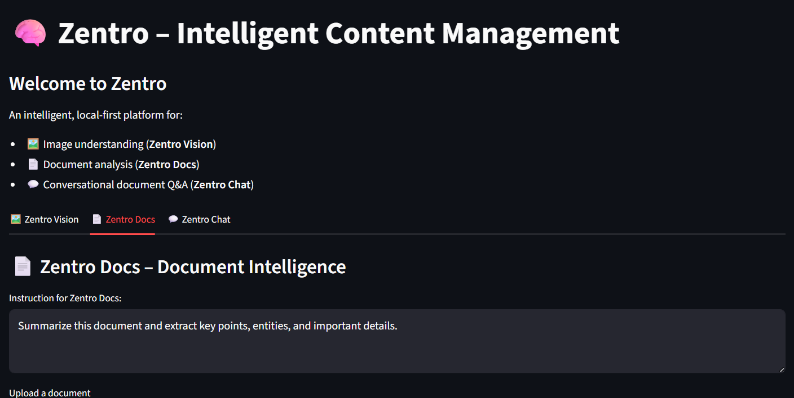
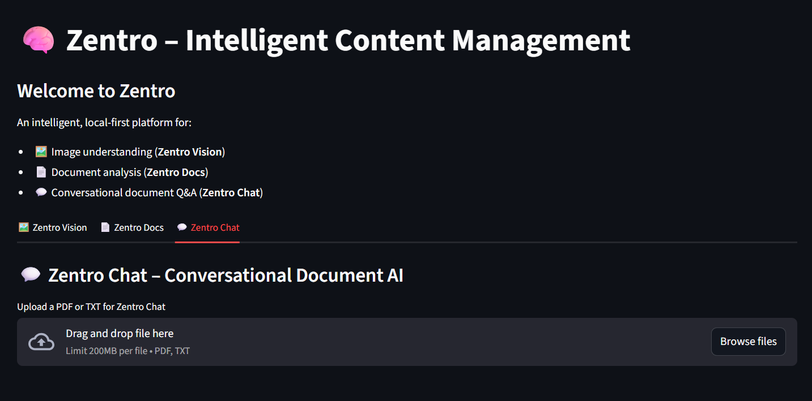

# ⚡ Zentro – Intelligent Content Management v1.0


> **Open-source | Offline-first | RTX-optimized**  
> If this helps, please ⭐ [star the repository](https://github.com/dragonpilee/zentro)!

---

## 🧠 Zentro — Overview

Zentro is an offline, GPU-accelerated platform for image & document intelligence and retrieval-augmented conversational AI. Built for local RTX GPUs and powered by Cyclops-VL 2.0 — an in-house vision-language model — it provides fast on-device reasoning, document understanding, and RAG workflows.

Key pillars:
- Local-first, privacy-preserving
- CUDA & mixed-precision inference
- Optimized for NVIDIA RTX GPUs

---

## ✨ Core Features

- Zentro Vision — object, text, layout detection, diagram analysis, image summarization  
- Zentro Docs — PDF/TXT parsing, metadata extraction, structured summaries  
- Zentro Chat — offline RAG with GPU embeddings, cosine retrieval, Cyclops-VL 2.0 grounding  
- Fast GPU embeddings, TensorRT-friendly paths, AMP mixed precision

---

## ⚡ GPU Optimization (Open-Source)

- CUDA-accelerated inference and embeddings  
- Mixed Precision (AMP) support  
- TensorRT-friendly model flow  
- Optimized for RTX 2050 → 4090 & A-series

---

## 🧩 Tech Stack

| Component | Technology |
|---|---|
| UI | Streamlit |
| Backend | FastAPI (OpenAI-compatible endpoints) |
| V-L Model | Cyclops-VL 2.0 (in-house) |
| Embeddings | SentenceTransformers (GPU) |
| Retrieval | Cosine similarity (local) |
| Parsing | PyPDF / text utilities |
| Deployment | Conda / uvicorn / Streamlit |

---

## 💻 Requirements

- Python 3.10+  
- NVIDIA GPU with CUDA (tested RTX series)  
- Conda/Mamba recommended  
- Optional: TensorRT for further speedups

---

## 📦 Quick Install (recommended)

```powershell
mamba create -n zentro -c conda-forge python=3.10 -y
conda activate zentro
pip install -r requirements.txt
# Optional: install cupy/cuda toolkit per your CUDA version
```

---

## 🚀 Run Locally (Offline)

Start backend:
```powershell
uvicorn backend:app --reload --host 127.0.0.1 --port 8000
```

Health:
```
http://127.0.0.1:8000/health
```

Start frontend:
```powershell
streamlit run streamlit_app.py
```

UI:
```
http://localhost:8501
```

Backend URL (default):
```
http://127.0.0.1:8000
```

---

## 🖼 Screenshots 

  
  



---

## 🔐 Privacy & Modes

- Offline open-source version: fully local, no telemetry, no external APIs.  
- Commercial cloud-managed version (optional): managed cloud service with multi-tenant features, orchestration, centralized storage, RBAC and monitoring. The cloud product is separate from this repo.

---

## 🛠 Troubleshooting

- Backend not reachable: ensure uvicorn process is running and port 8000 is free.  
- GPU not detected:
```python
import torch
torch.cuda.is_available()
```
- Chat not returning answers: ensure documents are indexed and embeddings built.

---

## 📁 Project Structure

```
zentro/
│── backend.py
│── streamlit_app.py
│── environment.yml
│── requirements.txt
│── README.md
│── 1.png
│── 2.png
│── 3.png
```

---

## 🚀 Future Work

- Advanced OCR & handwriting recognition  
- Knowledge graph extraction & analytics  
- TensorRT end-to-end pipelines  
- Multi-user sync (cloud product)

---

## 🤝 Contributing

Contributions welcome. Follow standard PR workflow and keep changes GPU-friendly and offline-first.

---

## 📜 License

MIT License — free to use, modify, and share. Attribution appreciated.

---

💚 Built for RTX GPUs — local-first,
